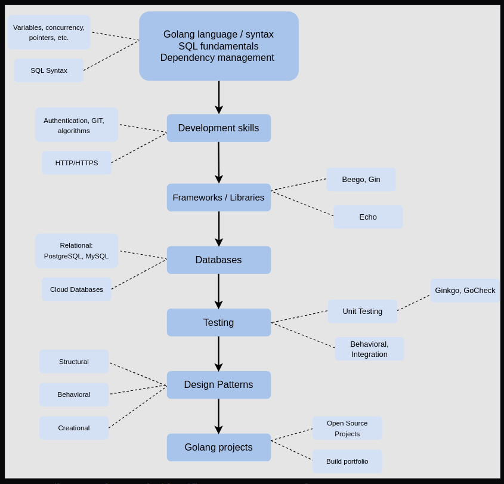

# Golang Interview Questions and Answers

### 🚀 Golang Interview Questions and Answers 👋
- [Persian](persian/fa.md)
- English
  - [Concurrent Processes](english/concurrentـprocesses.md)
  - [Basic](english/basic.md)
  - [Build](english/build.md)

## How to become a Golang developer: 6 step career guide
### This career guide at a glance:
* Step 1: Learn the basics of Go
* Step 2: Master Go libraries and other tools
* Step 3: Learn testing with Go
* Step 4: Understand Go patterns
* Step 5: Start building your portfolio
* Step 6: Practice Go coding interview questions

#### Golang Developer Roadmap

#### Step 1: Learn the basics of Go
* Filenames, keywords, identifiers
* Operators, types, functions, and constants
* Pointers, structures, methods
* Maps, arrays, slices
* Go CLI
* Interface
* Error handling
* Goroutine, Channel, Buffer
* Panic, Defer, Error, Recover
* Go design patterns

#### Step 2: Master Go libraries and other tools
* Go dependency management tools
* Semantic versioning
* Scripts and repositories
* Go libraries
* SQL fundamentals
* GIT
* Basic authentication
* HTTP/HTTPS
* Web frameworks and routers
* Relational databases (PostgreSQL)
#### Step 3: Learn testing with Go
* Unit testing
* Integration testing
* Behavior testing
* E2E testing
#### Step 4: Understand Go patterns
* Structural
* Creational
* Behavioral
* Concurrency
* Stability
#### Step 5: Start building your portfolio
* Completing online courses on Go
* Contributing to open source Go projects
* Building Go projects from scratch
* Implementing Go units in existing projects
* Coding classic algorithm problems with Go
* Completing courses on adjacent technologies (i.e. SQL)
#### Step 6: Practice Go coding interview questions
* What is a goroutine? How do you stop it?
* How do can check variable type at runtime?
* How do you format a string without printing?
* How do you concatenate strings in Go?
* What is Go 2?
* How do you initialize a struct in Go?